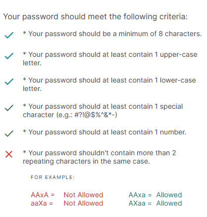

# Worldline Password Policy Helper

Edge extension that fixes 1Password-generated passwords to comply with strict enterprise password policies that limit character repetition.

https://microsoftedge.microsoft.com/addons/detail/password-policy-helper/iejllkmhkglceamonfmknamaigmlebcf

## Problem

Some enterprise/government password reset pages (e.g., Worldline PCI Portal) enforce a strict, non-standard password policy that rejects passwords generated by standard password managers like 1Password. The problematic rule: **no character (case-sensitive) may appear more than 2 times**.

Here's what the actual rejection looks like on the portal:



```
Your password should meet the following criteria:

 ✓  Your password should be a minimum of 8 characters.
 ✓  Your password should at least contain 1 upper-case letter.
 ✓  Your password should at least contain 1 lower-case letter.
 ✓  Your password should at least contain 1 special character (e.g.: #?!@$%^&*-)
 ✓  Your password should at least contain 1 number.
 ✗  Your password shouldn't contain more than 2 repeating characters in the same case.

    FOR EXAMPLE:
    AAxA =  Not Allowed        AAxa =  Allowed
    aaXa =  Not Allowed        AXaa =  Allowed
```

Standard password managers generate long random passwords that inevitably repeat characters, causing frustrating rejection loops. This extension breaks the cycle.

## Features

- **Fix** — Takes a 1Password-generated password and makes minimal same-class substitutions (uppercase replaces uppercase, digit replaces digit, etc.) so it complies. Changed characters are highlighted in the UI.
- **Generate** — Creates a compliant password of configurable length (8-40, default 24) from scratch.
- **Validate** — Real-time checklist showing pass/fail for all 6 policy rules as you type.
- **Page Integration** — Content script detects password fields, reads values into the popup, and fills fixed/generated passwords back into the page.

## Password Policy Rules

| # | Rule | Check |
|---|------|-------|
| 1 | Minimum 8 characters | `length >= 8` |
| 2 | At least 1 uppercase letter | `/[A-Z]/` |
| 3 | At least 1 lowercase letter | `/[a-z]/` |
| 4 | At least 1 special character | `/[#?!@$%^&*-]/` |
| 5 | At least 1 digit | `/[0-9]/` |
| 6 | No character appears more than 2 times (case-sensitive) | Count each char; all counts must be <= 2 |

## Installation

1. Clone or download this repository
2. Open `chrome://extensions` (or `edge://extensions`) in your browser
3. Enable **Developer mode** (toggle in the top right)
4. Click **Load unpacked** and select the repository folder
5. The "PP" icon appears in your toolbar

## Usage

### Fix Tab (Primary Use Case)

1. Navigate to the password reset page
2. Let 1Password fill or generate a password
3. Click the extension icon, go to the **Fix** tab
4. Click **Read** to pull the password from the page (or paste it manually)
5. Click **Fix Password** — changed characters are highlighted in yellow
6. Click **Copy** to save it to clipboard (then update 1Password), or **Fill on Page** to write it back into the password field

### Generate Tab

1. Adjust the length slider (8-40)
2. Click **Generate Password**
3. Copy or fill the result

### Validate Tab

1. Type or paste any password
2. The 6-rule checklist updates in real-time

## Project Structure

```
password-policy-helper/
├── manifest.json              # Manifest V3 extension config
├── lib/
│   ├── validator.js           # Policy validation (all 6 rules) + shared utilities
│   ├── generator.js           # Compliant password generation
│   └── fixer.js               # Fix passwords with minimal same-class substitutions
├── popup/
│   ├── popup.html             # Tabbed popup UI (Fix / Generate / Validate)
│   ├── popup.css              # Styles
│   └── popup.js               # UI logic, content script messaging
├── content/
│   └── content.js             # Password field detection, read/write, indicators
├── icons/
│   ├── icon-16.png
│   ├── icon-48.png
│   └── icon-128.png
├── tests/
│   ├── tests.html             # Browser-based test runner
│   ├── tests.js               # Test suite (ES modules)
│   └── run-tests.mjs          # Node.js test runner (same tests)
└── tools/
    └── generate-icons.mjs     # Dev tool to regenerate placeholder icons
```

## Running Tests

**Node.js** (97 tests covering validator, generator x1000, fixer):

```bash
node tests/run-tests.mjs
```

**Browser:**

Open `tests/tests.html` in Chrome (via a local file server or `file://` with module support).

## Tech Stack

- Vanilla JavaScript — no frameworks, no external dependencies
- Chrome Manifest V3 (compatible with Edge)
- `crypto.getRandomValues()` for cryptographically secure randomness
- ES modules for code sharing between library, popup, and tests

## License

MIT — see [LICENSE](LICENSE).
